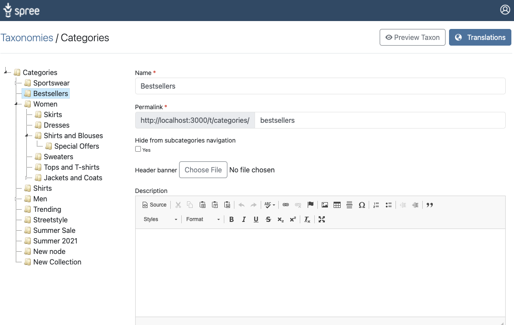
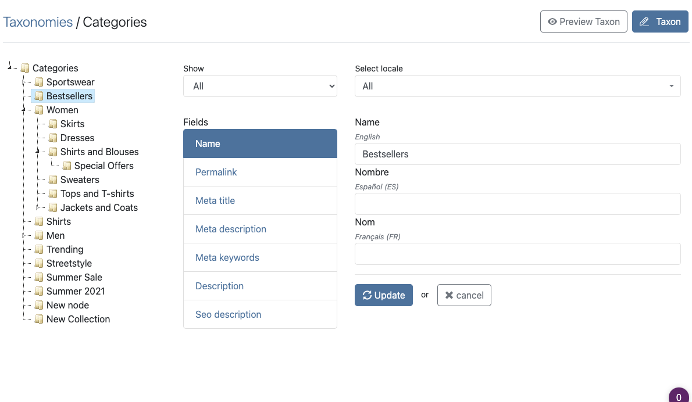
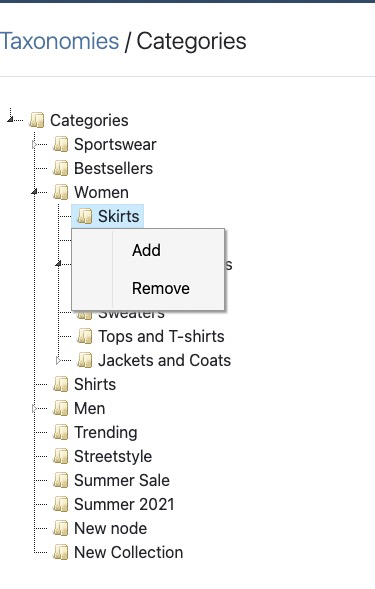
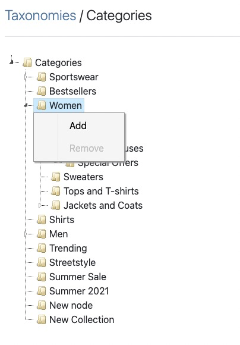

# SpreeAdminSkin

## Admin Screen

<h3>Taxon Edit</h3>


<hr>
<h3>Taxon Translations</h3>
<br>

<hr>
<h3>Taxon Remove Action</h3>
<br>



## Installation

1. Add this extension to your Gemfile with this line:

    ```ruby
    gem 'spree_admin_skin', github: "seadfeng/spree_admin_skin"
    ```

2. Install the gem using Bundler

    ```ruby
    bundle install
    ```

3. Copy & run migrations

    ```ruby
    bundle exec rails g spree_admin_skin:install
    ```

4. Restart your server

  If your server was running, restart it so that it can find the assets properly.

## Testing

First bundle your dependencies, then run `rake`. `rake` will default to building the dummy app if it does not exist, then it will run specs. The dummy app can be regenerated by using `rake test_app`.

```shell
bundle
bundle exec rake
```

When testing your applications integration with this extension you may use it's factories.
Simply add this require statement to your spec_helper:

```ruby
require 'spree_admin_skin/factories'
```

## Releasing

```shell
bundle exec gem bump -p -t
bundle exec gem release
```

For more options please see [gem-release REAMDE](https://github.com/svenfuchs/gem-release)

## Contributing

If you'd like to contribute, please take a look at the
[instructions](CONTRIBUTING.md) for installing dependencies and crafting a good
pull request.

Copyright (c) 2021 [name of extension creator], released under the New BSD License
